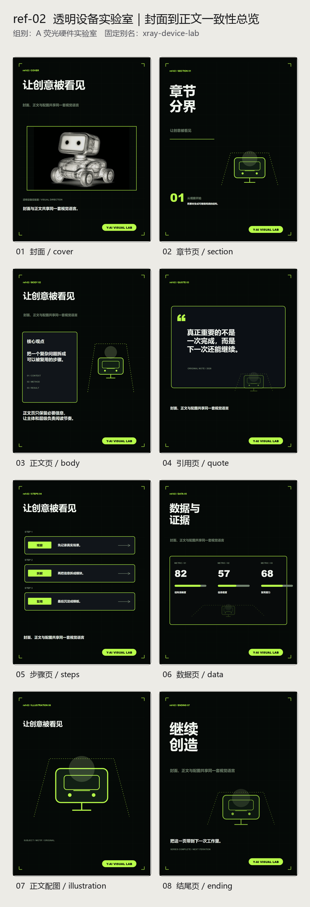
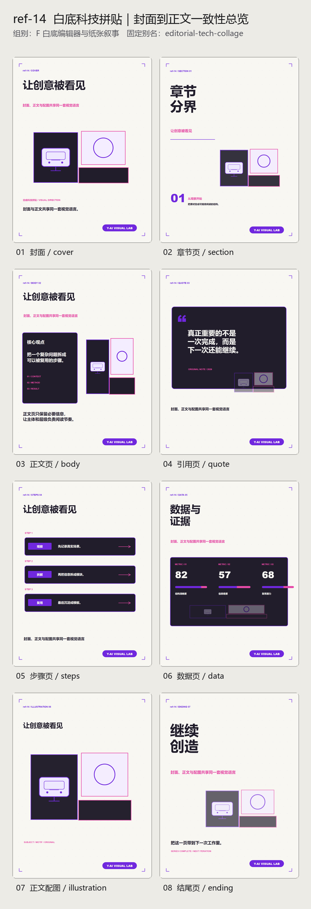
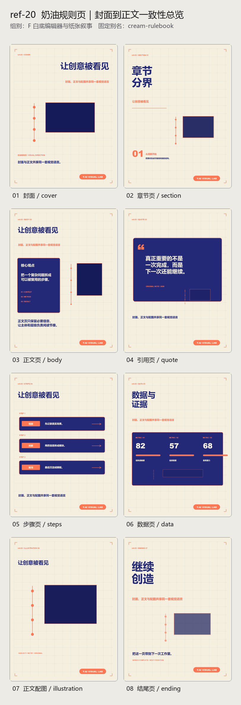

# 科技编辑视觉 Skill

这是一个面向中文科技内容的 Codex Skill。它可以先选定一种封面视觉方向，再把同一套颜色、字体层级、纹理、边框、卡片形状和配图语言延伸到正文排版、正文配图与结尾页。

它不是单纯的“封面提示词合集”，而是一套可编辑、可复用的视觉系统：

- 21 个固定视觉预设，分成 6 个检索组；
- 8 种页面：封面、章节、正文、引用、步骤、数据、配图、结尾；
- SVG 为可编辑源文件，也可以导出 PNG；
- 同一系列会保存设计参数，避免正文和封面变成两套风格。

## 效果预览

暗色硬件系列：



白底科技系列：



奶油纸张系列：



## 安装

把仓库克隆到本地，然后将 `tech-editorial-design` 文件夹复制到 Codex 的 Skills 目录。Windows、macOS 和 Linux 都可以安装。

### Windows PowerShell

首次安装：

```powershell
git clone https://github.com/wdy199210-blip/skill.git "$HOME\skill-library"
New-Item -ItemType Directory -Path "$HOME\.codex\skills" -Force | Out-Null
Copy-Item "$HOME\skill-library\tech-editorial-design" "$HOME\.codex\skills" -Recurse -Force
```

如果已经克隆过仓库，先更新再复制：

```powershell
git -C "$HOME\skill-library" pull --ff-only
Copy-Item "$HOME\skill-library\tech-editorial-design" "$HOME\.codex\skills" -Recurse -Force
```

安装后的入口文件应位于：

```text
C:\Users\你的用户名\.codex\skills\tech-editorial-design\SKILL.md
```

### macOS / Linux 终端

在 macOS 的“终端”或 Linux 的 Shell 中运行：

首次安装：

```bash
git clone https://github.com/wdy199210-blip/skill.git "$HOME/skill-library"
mkdir -p "$HOME/.codex/skills"
cp -R "$HOME/skill-library/tech-editorial-design" "$HOME/.codex/skills/"
```

如果已经克隆过仓库，先更新再复制：

```bash
git -C "$HOME/skill-library" pull --ff-only
cp -R "$HOME/skill-library/tech-editorial-design" "$HOME/.codex/skills/"
```

安装后的入口文件应位于：

```text
~/.codex/skills/tech-editorial-design/SKILL.md
```

### 所有系统：手动安装

如果不想使用 Git，可以在 GitHub 点击 `Code → Download ZIP`，解压后只复制完整的 `tech-editorial-design` 文件夹：

- Windows：复制到 `%USERPROFILE%\.codex\skills\`；
- macOS / Linux：复制到 `~/.codex/skills/`。

不要只复制 `SKILL.md`，`agents`、`references` 和 `scripts` 文件夹也必须一起保留。

重新打开 Codex 后，可以直接点名 `$tech-editorial-design`，也可以使用中文名称“科技编辑视觉系统”。

## 最简单的调用方式

```text
使用 $tech-editorial-design，选择“白底科技拼贴”，
为“普通人如何搭建 AI 工作流”制作一套 8 页竖版图文。
包括封面、章节、正文、引用、步骤、数据、正文配图和结尾页。
整套内容严格锁定同一种颜色、字体层级、边框、纹理和配图处理方式。
```

也可以只生成单页：

```text
使用科技编辑视觉系统，选择“柔彩拼图”，
生成一张正文配图，主题是“多个 Skill 像拼图一样组成工作流”，
少文字，保持封面同款半透明材质和柔和配色。
```

21 个预设的中文名、英文别名和适用场景见：

- [预设目录](tech-editorial-design/references/preset-catalog.md)
- [中文调用手册](tech-editorial-design/references/invocation-guide.md)
- [封面到正文的一致性规则](tech-editorial-design/references/series-consistency.md)

## 本地脚本依赖

- Python 3；
- 导出 PNG 时需要本机安装 Edge、Chrome 或 Chromium；脚本会查找 Windows、macOS 和 Linux 的常见安装位置；Safari 和 Firefox 暂不用于 PNG 导出，没有检测到支持的浏览器时仍会保留 SVG；
- 生成多图总览时需要 Pillow：`python -m pip install -r tech-editorial-design/requirements.txt`；
- macOS 默认优先使用苹方字体；Linux 建议安装 Noto Sans CJK 或文泉驿正黑，避免总览图中的中文变成方框。

Skill 的正式入口是 [SKILL.md](tech-editorial-design/SKILL.md)。脚本默认保护已有文件；除非明确需要覆盖，否则请使用新的输出目录。

## 使用边界

该 Skill 用参考图提取视觉指纹，不承诺像素级复制，也不应复制受保护的 Logo、插画、完整版式或特定创作者的独特签名风格。引用图片作为主体素材前，请确认自己拥有使用权限。

本项目使用 [MIT License](LICENSE)，版权人为 `dy w`。在保留版权与许可声明的前提下，可以使用、修改、分发和商业使用；软件按“现状”提供，不附带担保。
